# Red Dead Dimension

A Wild West train shooter where your hand is the gun. Built in 24 hours at SteelHacks 2026.

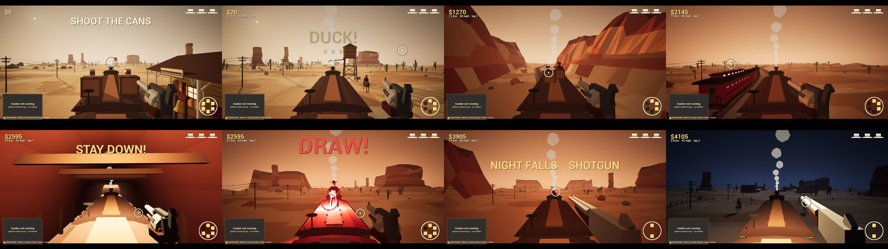

You're on the roof of a moving steam train and bandits keep coming. Make a finger gun at your webcam and point. That's your crosshair. There's no controller.

| You do | Game does |
| --- | --- |
| Point a finger gun | Aim |
| Drop your thumb | Fire |
| Slap the gun hand with your other hand | Reload |
| Lean / duck for real | Dodge bullets, signal arms and tunnels |
| Lower your arm | Holster (for the showdown) |

You have three hats. Riders, boarders, a second train, then a boss duel. Then it all comes round again, faster, and night falls. Lose all three hats and it's over.

## How it works

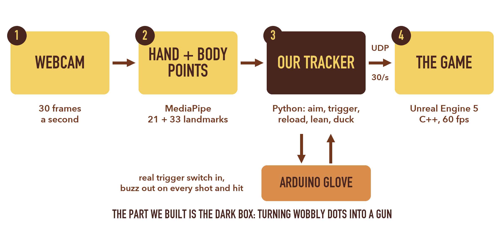

We didn't train a model. MediaPipe gives us hand and body skeletons, and everything after that is our own geometry in `tracker/`:

- **Real-world scale from one RGB camera.** Palm bones don't stretch, so how big they look tells us how far away the hand is. Aim is measured in actual centimetres of fingertip travel, so it feels the same sitting at a laptop or standing across a room.
- **Aim is fingertip position, not finger direction.** We tried casting a ray along the finger. A finger pointed at a camera is basically a dot, so the direction is useless. Position is steady to about 2 mm.

  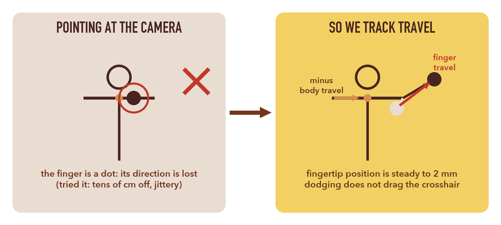

- **Shots rewind.** Pulling the trigger jerks your hand. We keep a second of aim history and fire where you were pointing just before the jerk.

  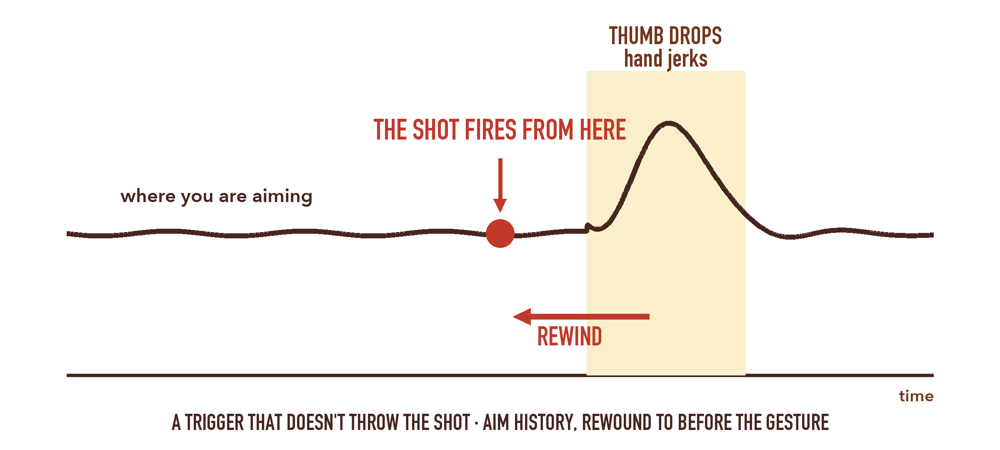

- **One Euro filter** on the aim: heavy smoothing when you hold still, almost none when you move fast.
- **Crowd-proof.** A hand only counts if it's attached to the player's arm and isn't farther away than their chest. Spectators behind you can't steal the aim.

Every threshold in `tracker/config.py` marked `[rec]` came from replaying recorded sessions, not guessing. The pipeline has no camera or network code in it, so recordings replay through it exactly.

The game side is C++ in `unreal/FingerGunGame/Source`. The world streams under a fixed train in chunks, every enemy shot is telegraphed and takes long enough to arrive that you can dodge it, and the crosshair leans onto targets so webcam jitter doesn't cost you hits. More in [docs/ARCHITECTURE.md](docs/ARCHITECTURE.md).

## Screenshots

| | |
| --- | --- |
| 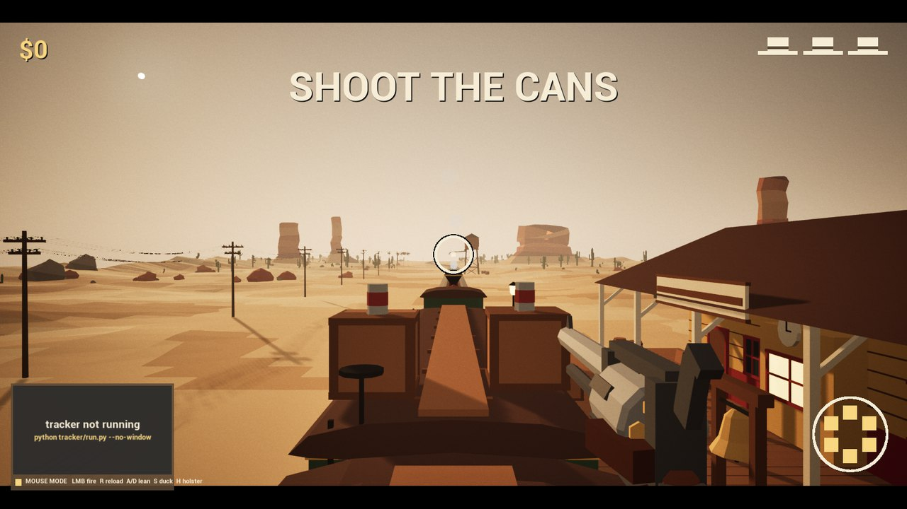 Shooting cans at the station: the tutorial doubles as tracker calibration | 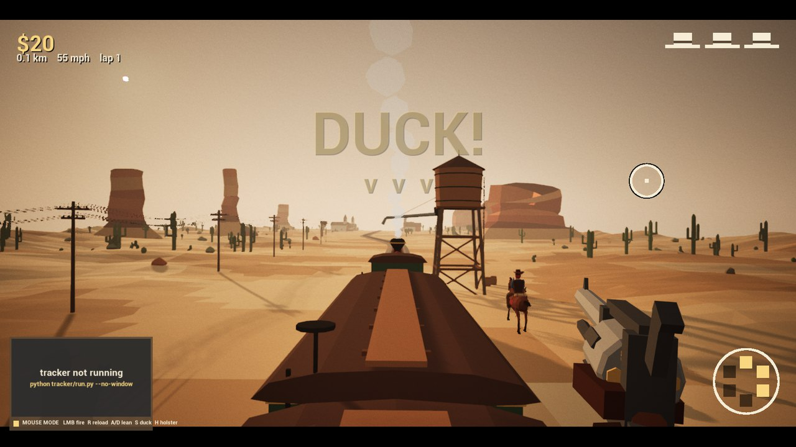 Water tower spout ahead, duck for real |
| 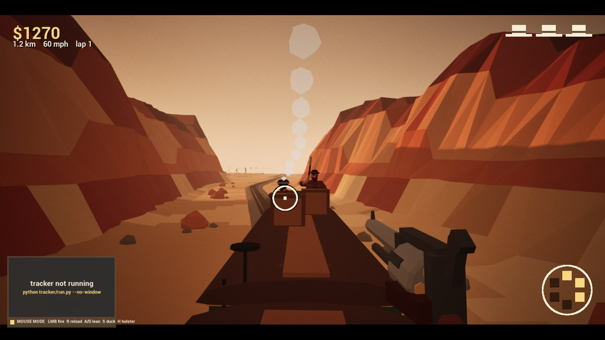 Riders in the canyon | 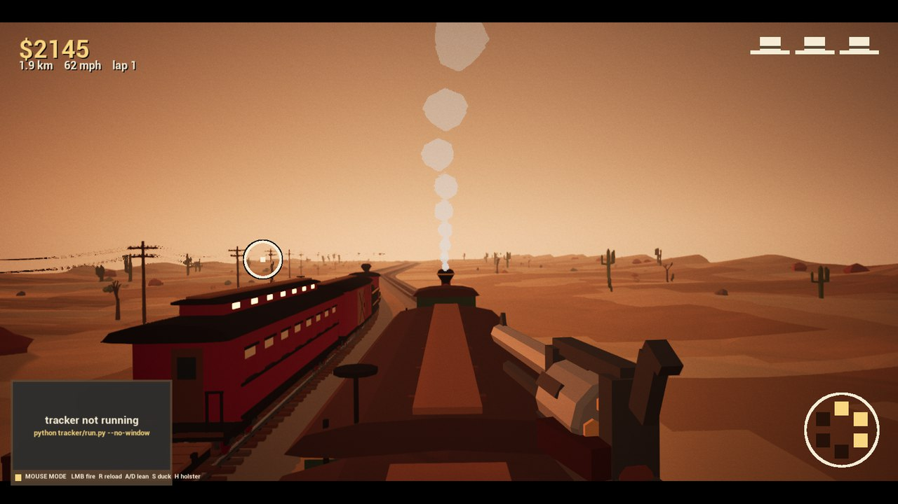 The bandit train pulls alongside |
| 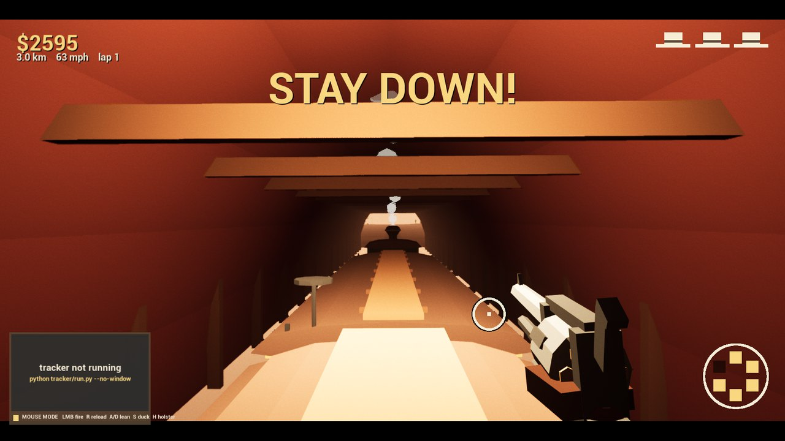 Stay down through the tunnel | 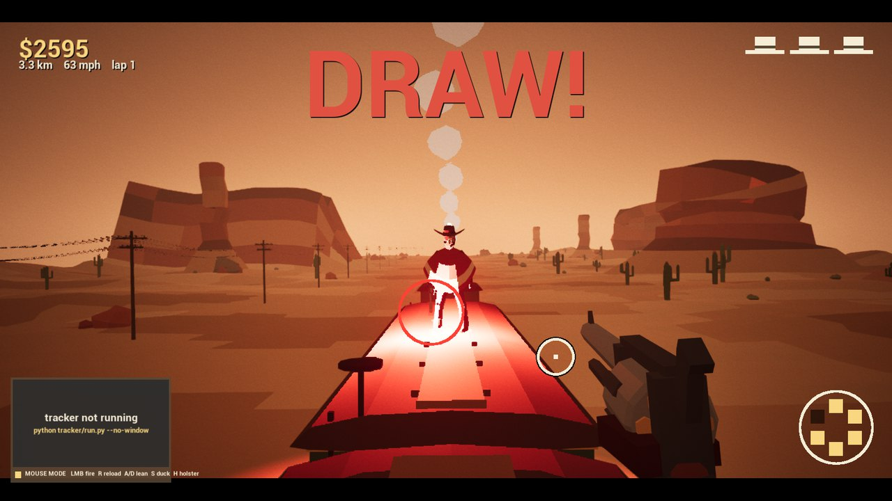 Holster, wait, DRAW |
| 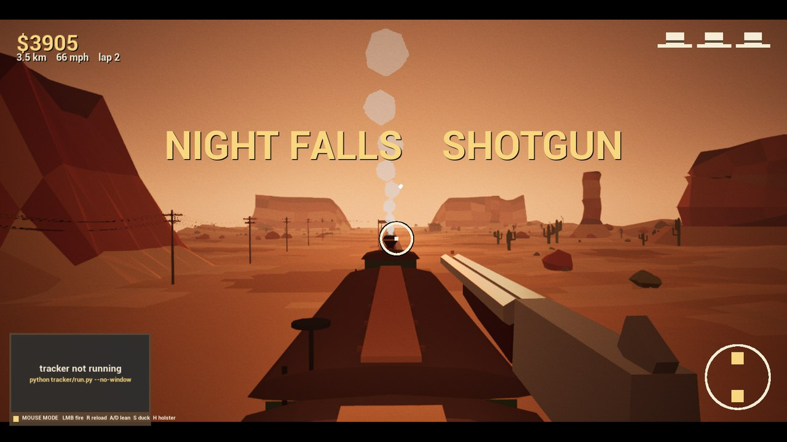 Beat the boss and night falls, with a new gun | 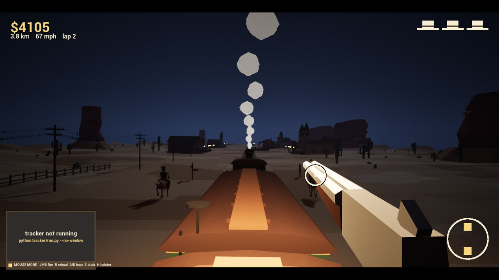 Lap two, in the dark |

## The glove

Optional. An Arduino with a switch under the thumb, a buzzer and an LED. The click gives an exact trigger time and you feel a buzz when you get hit. Firmware is in `arduino/finger_gun_glove/`. The game plays fine without it.

## Running it

You need Unreal Engine 5.8, Python 3 and a webcam.

```bash
cd tracker
python3 -m venv .venv
.venv/bin/pip install -r requirements.txt
```

The two MediaPipe model files go in `tracker/models/`. The tracker prints the download links if they're missing.

Open `unreal/FingerGunGame/FingerGunGame.uproject` once and let it build. Then, from the repo root:

```bash
./play.sh
```

On Windows:

```powershell
powershell -ExecutionPolicy Bypass -File .\play.ps1
```

This starts the game and the tracker together. The game also works with mouse and keyboard if the tracker isn't running (LMB fire, R reload, A/D lean, S duck, H holster). Space recentres the aim if you or the camera moved.

Useful tracker flags (run from `tracker/`):

```bash
python run.py                          # tuning window with the skeleton overlay
python run.py --record                 # save landmarks to a .jsonl
python run.py --replay recordings/x.jsonl
python run.py --set aim_span_m=0.5     # override any config value
```

Don't upgrade mediapipe past 0.10.21. Newer versions crash or leak memory on macOS.

## All our own

Every model in the game is built by Python scripts in `art/blender/` (characters, horses, the train, the buildings, the canyon chunks) and exported from Blender. Placeholder sounds are generated by `unreal/FingerGunGame/Scripts/make_audio.py`.

## Team

- **Akhil** — computer vision tracker, game code
- **Lohith** — Unreal project
- **Jason** — Arduino glove, OSC bridge
- **Jerry** — art direction, audio, submission

## Layout

```
tracker/   Python computer vision + gesture logic
unreal/    UE5 game
arduino/   glove firmware
art/       Blender build scripts and exported models
docs/      architecture notes, slides, screenshots
```
