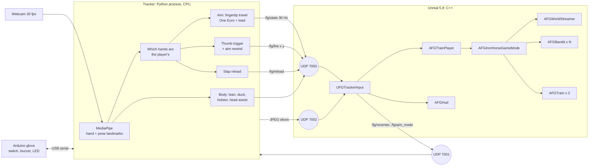
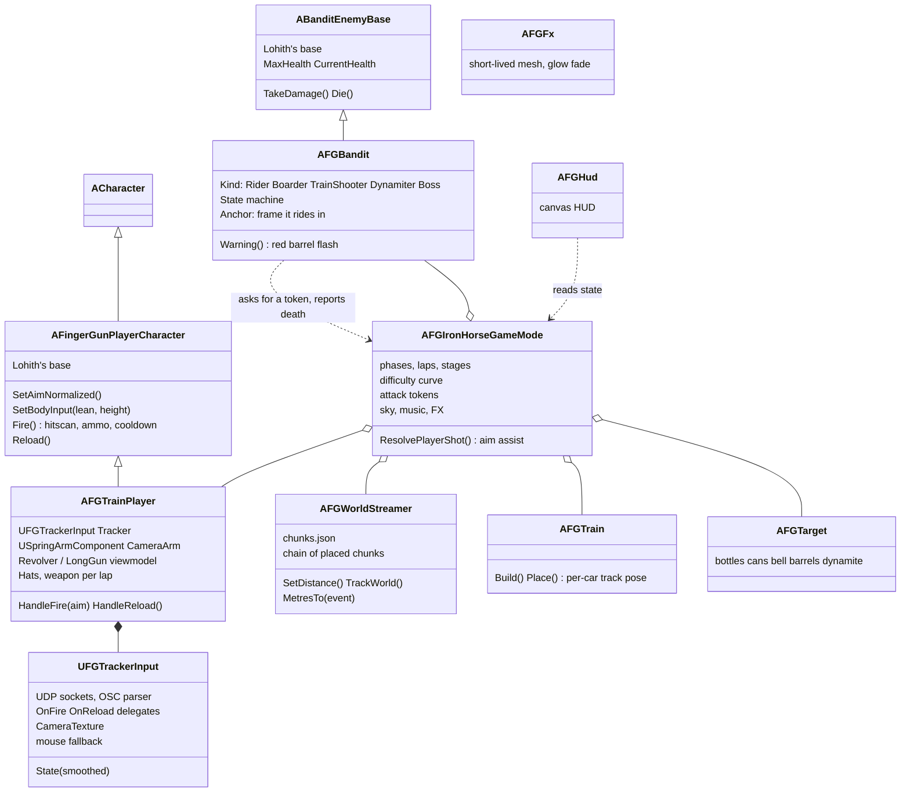
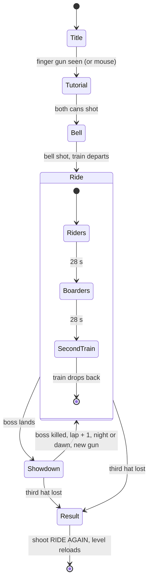
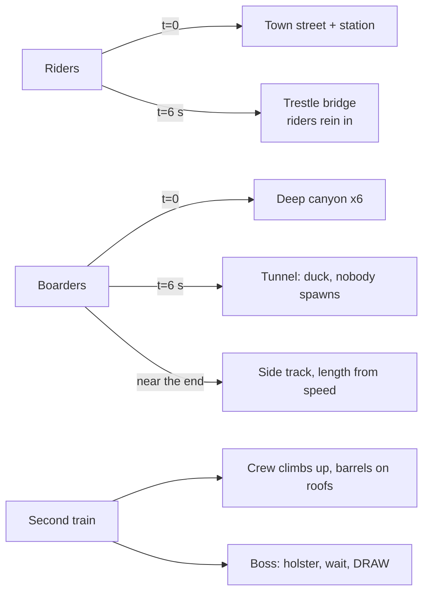
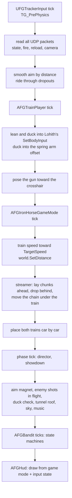
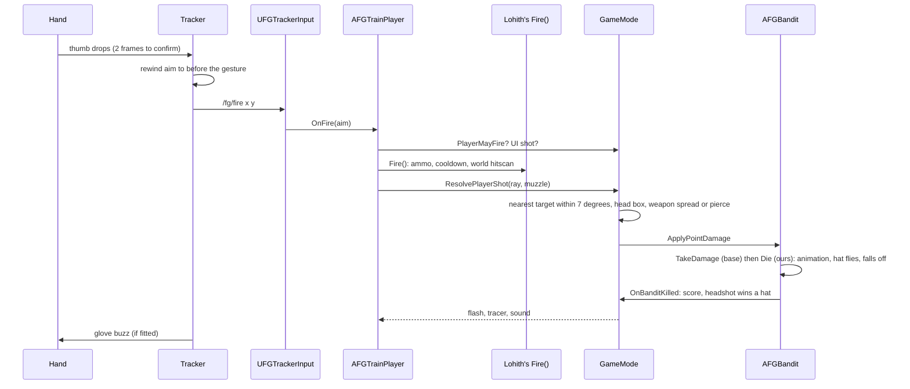
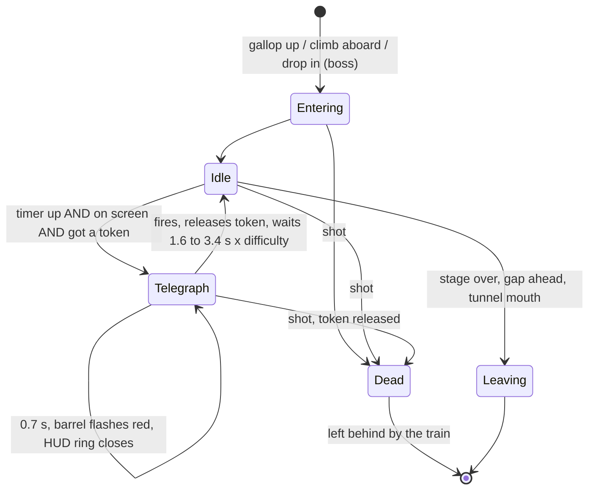
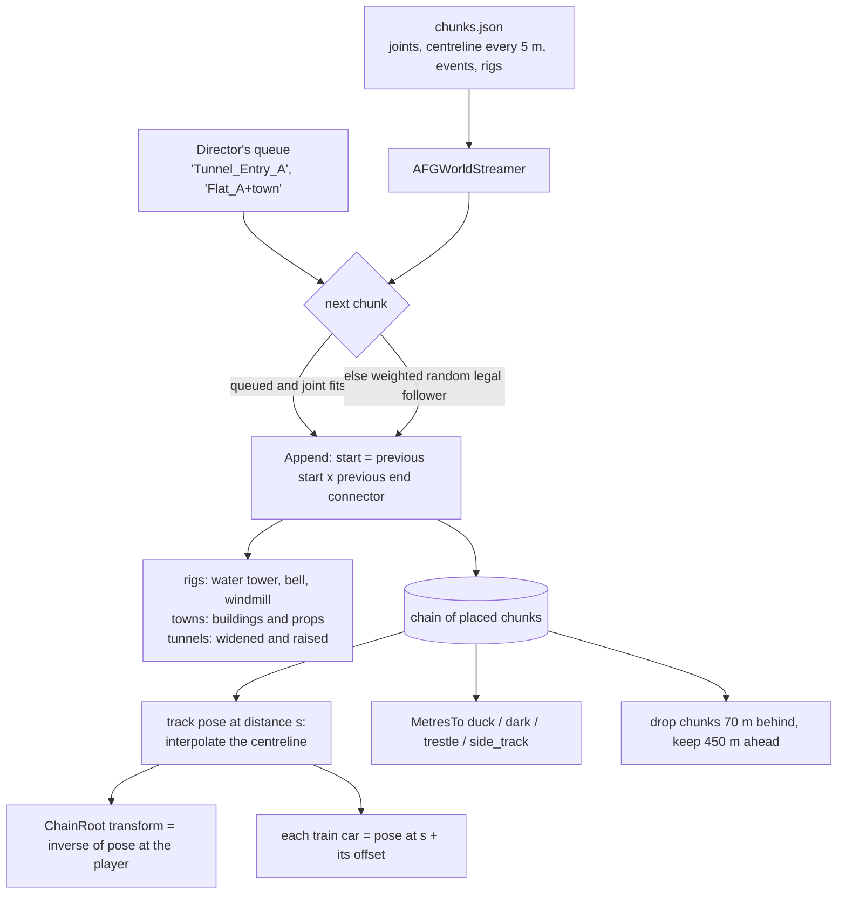
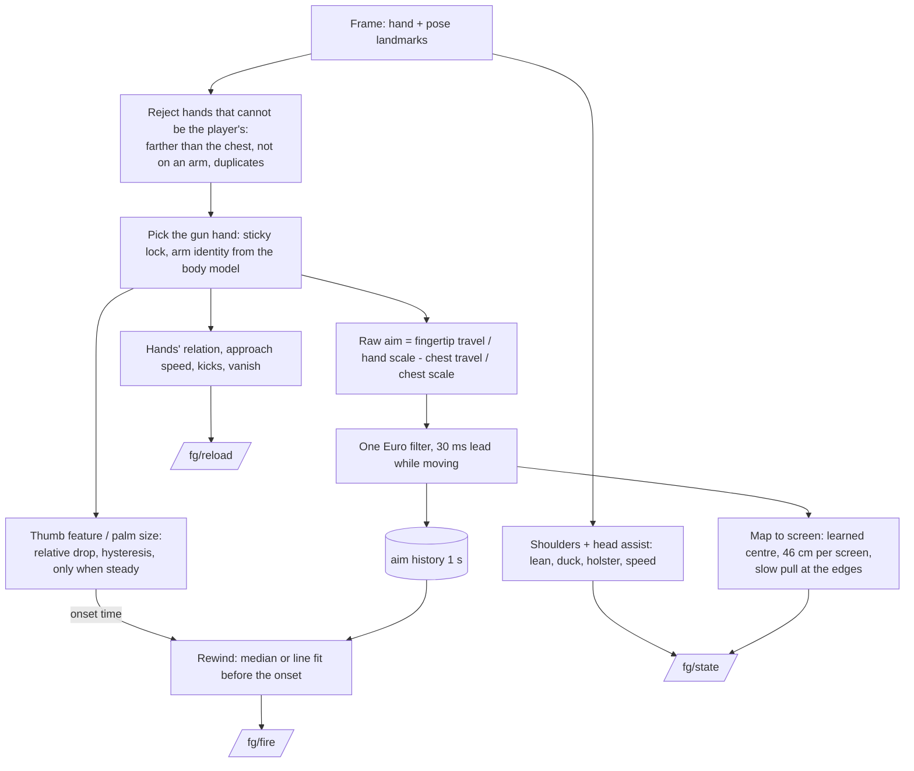

# How Red Dead Dimension is built

The design, the Unreal patterns it uses, and the flow of events, with diagrams (they render on GitHub). Source is in `unreal/FingerGunGame/Source/FingerGunGame/` and `tracker/`.

## 1. The whole system

Two processes, three UDP ports, one contract (`tracker/protocol.py`, PLAN.md section 4). Either side can be swapped out: `fake_tracker.py` stands in for the tracker, mouse mode stands in for it inside the game, `osc_monitor.py` stands in for the game.

## 2. Classes

## 3. Unreal patterns used, and why

| Pattern | Where | Why |
|---|---|---|
| **Gameplay Framework roles** | `AGameModeBase` owns rules and the run; `APawn`/`ACharacter` is the player; `AHUD` draws; actors are things in the world | The engine's own separation of "rules", "body" and "screen". The HUD only reads the game mode, it never changes it |
| **Inheritance over the teammate's classes** | `AFGTrainPlayer : AFingerGunPlayerCharacter`, `AFGBandit : ABanditEnemyBase` | Lohith's ammo, cooldown, hitscan, health and death stay the single source of truth. Ours adds behaviour without editing his files, so two people can work without merge fights |
| **Component composition** | `UFGTrackerInput` (actor component) on the player; spring arm, camera, skeletal and static mesh components | Input is a reusable part, not baked into the pawn. The same component would drive any pawn |
| **Observer (delegates)** | `OnFire`, `OnReload` multicast delegates from the input component; the player subscribes with `AddUObject` | The input layer does not know who listens. Mouse, tracker and the autoplay test all raise the same events |
| **State machines** | Game: `EFGPhase` and `EFGStage`. Bandit: `EFGBanditState`. Showdown: steps 0 to 6 | Every behaviour is "what state am I in, what ends it". Easy to reason about on no sleep |
| **Director / spawner** | `TickRide` decides what to spawn and which set pieces to queue, from lap, stage time and difficulty | One place holds the pacing. Difficulty is five small functions (`TargetSpeed`, `MaxAlive`, `TokenLimit`, `ShotFlight`, `FireDelayScale`) |
| **Token (semaphore)** | `RequestAttackToken` / `ReleaseAttackToken` | At most 2 (later 3) bandits may be mid-attack, which guarantees no undodgeable crossfire |
| **Data-driven content** | `chunks.json`: joints, centrelines, events, rigs, weights. Weapons are a table of structs | New chunks and guns are data, not code. The art pipeline writes the JSON, the game reads it |
| **Streaming with a moving origin** | `AFGWorldStreamer`: the train stays at the origin, the world is transformed under it | No floating-point drift however far you ride, and all gameplay happens in one fixed frame: "12 m ahead on the boxcar roof" is a constant |
| **Anchor frames (strategy as a function)** | `FFGBanditSpec::Anchor`, `AFGTarget::Anchor`: a `TFunction<FTransform()>` giving the frame an object lives in | The same bandit code rides our boxcar, the other train, or open ground. Fixed a real bug: props in world coordinates slid across the roof on curves |
| **Asset loading by name** | `FGAssets`: `LoadObject` by path, animations found through the Asset Registry by suffix | No Blueprint wiring. Re-importing art never breaks references. Preloaded and held at start so nothing builds mid-run |
| **Object lifetime via `UPROPERTY`** | Every held actor, component, texture and preloaded asset is a `UPROPERTY` `TObjectPtr` | The garbage collector must see references, or it frees them. (Dropped assets being rebuilt was one cause of the early freezes) |
| **Fire-and-forget FX actors** | `AFGFx::Spawn(...)`: mesh, lifetime, velocity, optional light and translucent fade | No particle system to author. A muzzle flash, tracer, smoke puff and flying hat are the same 60-line actor |
| **Runtime configuration by console variable** | Renderer features switched off in `BeginPlay` | The project settings stay the artist's; the game takes what it needs for 60 fps without touching them |
| **Polling, non-blocking sockets** | UDP read in the component's tick, no thread | 30 packets a second does not need a thread, and there is nothing to lock |
| **Headless editor scripting** | `Scripts/*.py` run with `UnrealEditor-Cmd -run=pythonscript` | Import 190 FBX files, make the level, materials and audio without opening the editor. Repeatable by any teammate |

## 4. Game flow

What each stage queues into the world (it turns up 10 to 17 s later, in order):

## 5. One frame

## 6. A shot, end to end

## 7. A bandit

An enemy bullet is aimed at where the head was when fired and takes 0.7 s (down to 0.45 s late in a run) to arrive. At arrival the game checks the head's distance to that point: inside 32 cm is a hit, otherwise a whiz and a dodge on the score sheet.

## 8. The chunk streamer

Joint rule: chunk B may follow A when `B.start_joint == A.end_joint` (`O` open desert, `C` deep canyon, `T` tunnel, `OD` with side track). Random picks stay in open desert; canyons, tunnels and side tracks only appear when the director asks, and with nothing queued the streamer heads for the way out.

## 9. Tracker pipeline

Tuning loop: play, the session is recorded as landmarks, replay it offline through this exact pipeline, change a threshold, compare numbers. 55 automated tests guard the behaviour.
